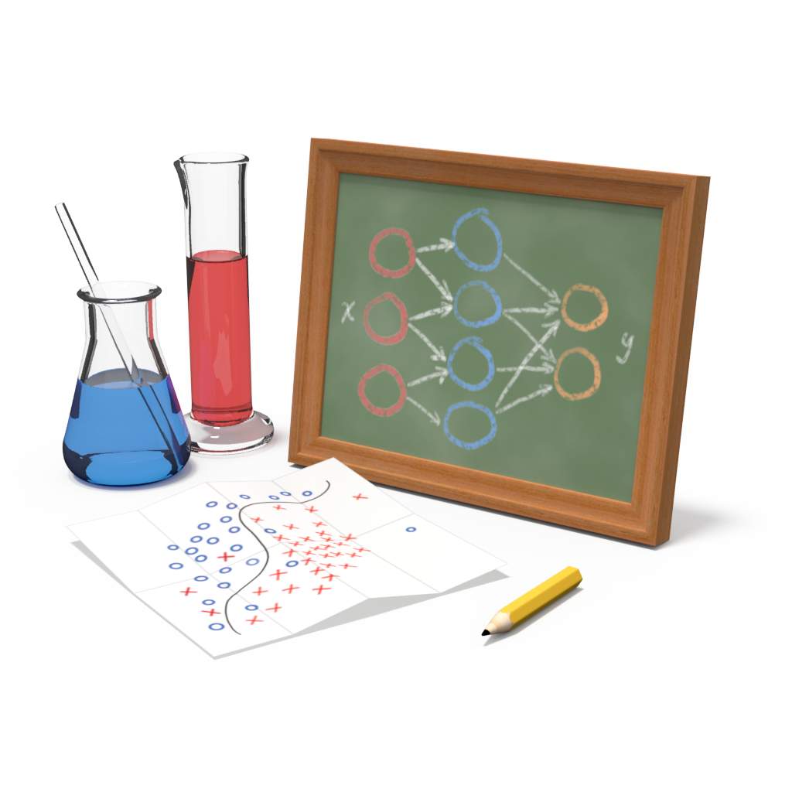

# Welcome!

Welcome to Samlab: the Sandia Machine Learning Laboratory. Samlab provides a
flexible framework for running, storing, and analyzing machine learning
experiments. Using Samlab’s concepts and components in your workflow allows you
to benefit from standardized storage mechanisms and interactive tools like the
Samlab Manager.

You can see the full Samlab documentation with tutorials at
https://samlab.readthedocs.io ... for questions, comments, or suggestions, get
in touch with our team at https://gitter.im/sandialabs/samlab.
