.. image:: ../artwork/samlab.png
    :width: 200px
    :align: right

.. _getting-started:

Getting Started
===============

Let's explore how to integrate Samlab into your workflow. For this
example, we will be training a simple neural network model to smooth
waveforms. That is, if we feed our trained model the noisy green curve
in the following plot as input, we want the model to produce a smoothed
version of it (the smooth orange curve) as output:

.. code:: ipython3

    import toyplot
    toyplot.plot(example, width=600, height=250);

.. raw:: html

    
<svg class="toyplot-canvas-Canvas" height="250.0px" id="ta65e0046ee524d7aa275009da52b8661" preserveAspectRatio="xMidYMid meet" style="background-color:transparent;fill:rgb(16.1%,15.3%,14.1%);fill-opacity:1.0;font-family:Helvetica;font-size:12px;opacity:1.0;stroke:rgb(16.1%,15.3%,14.1%);stroke-opacity:1.0;stroke-width:1.0" viewBox="0 0 600.0 250.0" width="600.0px" xmlns="http://www.w3.org/2000/svg" xmlns:toyplot="http://www.sandia.gov/toyplot" xmlns:xlink="http://www.w3.org/1999/xlink"><g class="toyplot-coordinates-Cartesian" id="t21c03a4b64334f6c9473c234aa61ac4c"><clipPath id="tfefd22f0853d43a1bc0e17e38f33de37"><rect height="170.0" width="520.0" x="40.0" y="40.0"></rect></clipPath><g clip-path="url(#tfefd22f0853d43a1bc0e17e38f33de37)"><g class="toyplot-mark-Plot" id="t2f223f4ee4ce4c9d8461e90fcb389e32" style="fill:none"><g class="toyplot-Series"><path d="M 50.0 154.71606163984544 L 55.0 176.53822826552323 L 60.0 150.28683595774845 L 65.0 156.01553537846084 L 70.0 169.21883371441308 L 75.0 152.96340751758098 L 80.0 137.21322749542128 L 85.0 148.87620436077137 L 90.0 148.58860080242664 L 95.0 189.68116463614672 L 100.0 168.6091382951697 L 105.0 150.4337788151634 L 110.0 132.96608567548444 L 115.0 170.00140022917083 L 120.00000000000001 176.12267707380758 L 125.0 176.0838624218357 L 130.0 168.6547671467932 L 135.0 163.35775518068266 L 140.0 139.1502635117343 L 145.0 167.4941087193183 L 150.0 171.2071835383885 L 155.0 183.226465201953 L 160.0 179.6824184803745 L 165.0 169.5417949683151 L 170.0 145.38939372195318 L 175.0 153.98844252427773 L 180.0 141.61031098412795 L 185.0 174.90357723488654 L 190.00000000000003 178.25866255873575 L 195.0 158.8552421821915 L 200.0 166.1448416163073 L 205.0 159.9619944468218 L 210.0 140.76728352806617 L 215.0 121.60262803095863 L 220.0 105.77679485871143 L 225.0 108.01387047810432 L 230.0 105.72876351109673 L 235.0 111.64331077280525 L 240.0 96.22136227019686 L 245.0 52.41195541516402 L 250.0 51.01575555148673 L 255.0 61.39470579705825 L 260.0 60.73247955012472 L 265.0 98.75215295577482 L 270.0 94.21187333840717 L 275.0 110.65041606133464 L 280.0 113.15689848430017 L 285.0 112.82178687551968 L 290.0 98.98038787088095 L 295.0 95.03603630764758 L 300.0 79.62628937643362 L 305.0 106.1177690519455 L 310.0 131.80603010516552 L 315.0 133.65514741682608 L 320.0 143.7005565134189 L 325.0 146.35040992603462 L 330.00000000000006 139.8637194650394 L 335.0 140.5144222110702 L 340.0 130.14843771927968 L 345.0 101.82743660153805 L 350.0 119.67830266266256 L 355.0 120.96722705990385 L 360.0 115.32433467854428 L 365.0 119.14464332965039 L 370.0 100.20238284201372 L 375.0 144.1857314586926 L 380.0 106.97911946685807 L 385.0 127.91547483632121 L 390.0 124.03314995595031 L 394.99999999999994 111.12060190249069 L 400.0 125.51207785028107 L 405.0 117.04578872264923 L 410.0 104.14226285990809 L 415.0 94.55006198122905 L 420.0 111.52175675002213 L 425.0 74.73218696718186 L 430.0 70.57356775395371 L 435.0 91.69366219121184 L 440.0 80.1139458025836 L 445.0 79.38995753255989 L 450.0 70.88092855573908 L 455.00000000000006 136.17500188332124 L 460.0 111.96847357292195 L 465.0 109.17183434914882 L 470.0 106.1571707278208 L 475.0 114.03778481004689 L 480.0 99.97733967304339 L 485.0 81.9307204190784 L 490.0 76.96821358743219 L 495.0 51.462945269158716 L 500.0 50.0 L 505.0 57.32852380037872 L 510.0 76.16175965695162 L 515.0 86.87551166038445 L 520.0 71.91311670148856 L 525.0 73.41462695681355 L 530.0 79.7317511797306 L 535.0 70.05196343570665 L 540.0 89.6389721864046 L 545.0 99.01813858751959" style="stroke:rgb(40%,76.1%,64.7%);stroke-opacity:1.0;stroke-width:2.0"></path></g><g class="toyplot-Series"><path d="M 50.0 162.24355991540665 L 55.0 161.08903452061932 L 60.0 158.18448912336976 L 65.0 156.57583004449242 L 70.0 154.93521501468794 L 75.0 158.8202264587214 L 80.0 157.93921646201542 L 85.0 157.95554344617267 L 90.0 155.3944934791753 L 95.0 155.48144531414837 L 100.0 158.05469748706244 L 105.0 162.3736569233307 L 110.0 164.57127501066645 L 115.0 166.21229216380604 L 120.00000000000001 160.5977475944269 L 125.0 160.47385541933227 L 130.0 162.7820114996906 L 135.0 168.3664981137427 L 140.0 169.44216680832085 L 145.0 168.71095768548835 L 150.0 165.30046116327918 L 155.0 163.67086953855528 L 160.0 161.25448685004915 L 165.0 165.22707726373275 L 170.0 166.42313880144582 L 175.0 165.0507008729795 L 180.0 163.1527426967966 L 185.0 160.96158447084633 L 190.00000000000003 157.76441653304087 L 195.0 155.12144256737486 L 200.0 149.76459282675634 L 205.0 146.03165499275372 L 210.0 138.34556457899927 L 215.0 130.94385882500703 L 220.0 123.9845388347854 L 225.0 111.3475514791028 L 230.0 99.24241382406558 L 235.0 90.42323852062026 L 240.0 83.65988868941649 L 245.0 82.87937292242353 L 250.0 81.34581768467939 L 255.0 81.89266796803915 L 260.0 82.0608443804275 L 265.0 83.90533600324113 L 270.0 89.07960627609859 L 275.0 93.97074858233867 L 280.0 95.99648009115816 L 285.0 101.0392900358049 L 290.0 104.71194305240388 L 295.0 109.0945290611171 L 300.0 112.76676688912644 L 305.0 116.45493482709693 L 310.0 119.45959400371024 L 315.0 124.07448670817573 L 320.0 127.97586464280151 L 325.0 130.44265877892423 L 330.00000000000006 131.94938473567055 L 335.0 130.74507328619706 L 340.0 128.70831631527685 L 345.0 125.97988151708034 L 350.0 120.85232295218913 L 355.0 121.3325465070395 L 360.0 117.60640175768258 L 365.0 117.35829477068718 L 370.0 119.82559625451078 L 375.0 118.87474061449169 L 380.0 119.3797240356447 L 385.0 119.57099670721192 L 390.0 117.90406554390725 L 394.99999999999994 117.27602989270893 L 400.0 113.64669936952332 L 405.0 110.0637068695593 L 410.0 103.69238386040735 L 415.0 100.09910744210308 L 420.0 96.6539234310023 L 425.0 91.52924339569995 L 430.0 86.39981448826546 L 435.0 89.95900771308915 L 440.0 91.89438677883282 L 445.0 91.63328428984687 L 450.0 95.12494915214009 L 455.00000000000006 99.95430660281713 L 460.0 100.87471521190952 L 465.0 101.07657905818671 L 470.0 100.80749639761697 L 475.0 98.64994269910804 L 480.0 89.07494248985013 L 485.0 83.00383695956755 L 490.0 79.33605088265674 L 495.0 77.19364431960825 L 500.0 72.51312564087957 L 505.0 69.56171311685402 L 510.0 69.31738320137096 L 515.0 68.54891096229032 L 520.0 72.79069173087319 L 525.0 78.23715157393094 L 530.0 90.01777515951852 L 535.0 99.70581698326473 L 540.0 108.20344191774059 L 545.0 118.36355518098266" style="stroke:rgb(98.8%,55.3%,38.4%);stroke-opacity:1.0;stroke-width:2.0"></path></g></g></g><g class="toyplot-coordinates-Axis" id="tb5eb03956e8440ad8a3c107c94afbadb" transform="translate(50.0,200.0)translate(0,10.0)"><line style="" x1="0" x2="495.0" y1="0" y2="0"></line><g><g transform="translate(0.0,6)"><text style="fill:rgb(16.1%,15.3%,14.1%);fill-opacity:1.0;font-family:helvetica;font-size:10.0px;font-weight:normal;stroke:none;vertical-align:baseline;white-space:pre" x="-2.78" y="8.555">0</text></g><g transform="translate(250.0,6)"><text style="fill:rgb(16.1%,15.3%,14.1%);fill-opacity:1.0;font-family:helvetica;font-size:10.0px;font-weight:normal;stroke:none;vertical-align:baseline;white-space:pre" x="-5.56" y="8.555">50</text></g><g transform="translate(500.0,6)"><text style="fill:rgb(16.1%,15.3%,14.1%);fill-opacity:1.0;font-family:helvetica;font-size:10.0px;font-weight:normal;stroke:none;vertical-align:baseline;white-space:pre" x="-8.34" y="8.555">100</text></g></g><g class="toyplot-coordinates-Axis-coordinates" style="visibility:hidden" transform=""><line style="stroke:rgb(43.9%,50.2%,56.5%);stroke-opacity:1.0;stroke-width:1.0" x1="0" x2="0" y1="-3.0" y2="4.5"></line><text style="alignment-baseline:alphabetic;fill:rgb(43.9%,50.2%,56.5%);fill-opacity:1.0;font-size:10px;font-weight:normal;stroke:none;text-anchor:middle" x="0" y="-6"></text></g></g><g class="toyplot-coordinates-Axis" id="taf0c26178a564c139a661d3de43c5034" transform="translate(50.0,200.0)rotate(-90.0)translate(0,-10.0)"><line style="" x1="10.318835363853266" x2="150.0" y1="0" y2="0"></line><g><g transform="translate(0.0,-6)"><text style="fill:rgb(16.1%,15.3%,14.1%);fill-opacity:1.0;font-family:helvetica;font-size:10.0px;font-weight:normal;stroke:none;vertical-align:baseline;white-space:pre" x="-4.445" y="-4.440892098500626e-16">-2</text></g><g transform="translate(36.64586392933276,-6)"><text style="fill:rgb(16.1%,15.3%,14.1%);fill-opacity:1.0;font-family:helvetica;font-size:10.0px;font-weight:normal;stroke:none;vertical-align:baseline;white-space:pre" x="-2.78" y="-4.440892098500626e-16">0</text></g><g transform="translate(73.29172785866552,-6)"><text style="fill:rgb(16.1%,15.3%,14.1%);fill-opacity:1.0;font-family:helvetica;font-size:10.0px;font-weight:normal;stroke:none;vertical-align:baseline;white-space:pre" x="-2.78" y="-4.440892098500626e-16">2</text></g><g transform="translate(109.93759178799829,-6)"><text style="fill:rgb(16.1%,15.3%,14.1%);fill-opacity:1.0;font-family:helvetica;font-size:10.0px;font-weight:normal;stroke:none;vertical-align:baseline;white-space:pre" x="-2.78" y="-4.440892098500626e-16">4</text></g><g transform="translate(146.58345571733105,-6)"><text style="fill:rgb(16.1%,15.3%,14.1%);fill-opacity:1.0;font-family:helvetica;font-size:10.0px;font-weight:normal;stroke:none;vertical-align:baseline;white-space:pre" x="-2.78" y="-4.440892098500626e-16">6</text></g></g><g class="toyplot-coordinates-Axis-coordinates" style="visibility:hidden" transform=""><line style="stroke:rgb(43.9%,50.2%,56.5%);stroke-opacity:1.0;stroke-width:1.0" x1="0" x2="0" y1="3.0" y2="-4.5"></line><text style="alignment-baseline:hanging;fill:rgb(43.9%,50.2%,56.5%);fill-opacity:1.0;font-size:10px;font-weight:normal;stroke:none;text-anchor:middle" x="0" y="6"></text></g></g></g></svg>

Preliminaries
-------------

It's a good idea to turn-on Python's standard logging, as Samlab uses it
extensively for informational and debugging output:

.. code:: ipython3

    import logging
    logging.basicConfig(level=logging.INFO)

In addition, we need to have a running instance of MongoDB that Samlab
will use to store the generated observations. For production use, you
will likely want to setup and administer a shared instance of MongoDB on
your own, but for tutorials and quick tests, Samlab provides a simple
way to quickly startup a MongoDB server that stores data in a temporary
location:

.. code:: ipython3

    import samlab.database
    db_server = samlab.database.Server()

.. parsed-literal::

    INFO:samlab.database:Starting database server: mongod --dbpath /var/folders/tl/h2xygzzn1154jzjn_n01x860001l4n/T/tmp6eod7a1l --directoryperdb --replSet samlab --bind_ip 127.0.0.1 --port 56012

... note that the data is effectively lost once the temporary server is
stopped, so you would not want to use it for real work!

Now, we can create a database connection to the server:

.. code:: ipython3

    database, fs = samlab.database.connect("example", db_server.uri)

Note that the "example" database is automatically created if it doesn't
already exist on the given server.

Data Ingestion
--------------

Before we can create a model, we'll need to generate some training data
and put it in the Samlab database. For this tutorial, we'll start with a
function that creates :ref:`observations` at random:

.. code:: ipython3

    import numpy
    import samlab.serialize
    
    def generate_observation():
        kernel = numpy.ones(9)
        kernel /= numpy.sum(kernel)
    
        input_features = numpy.cumsum(numpy.random.normal(size=(100,)))
        output_features = numpy.convolve(input_features, kernel, mode="same")
    
        attributes = {"filter-width": 9, "acknowledgements": "For Bev, and all she does to make life great."}
        content = {
            "input": samlab.serialize.array(input_features),
            "output": samlab.serialize.array(output_features),
            }
        tags = ["example", "smoothing"]
        
        return attributes, content, tags

We'll use :func:`samlab.observation.create_many` with our function to
generate observations and store them in the database:

.. code:: ipython3

    import samlab.observation
    with samlab.observation.create_many(database, fs) as observations:
        for i in range(1000):
            attributes, content, tags = generate_observation()
            observations.create(attributes=attributes, content=content, tags=tags)

.. parsed-literal::

    INFO:samlab.observation:Ingested 827 observations in 5.0s (165.27 observations/s).
    INFO:samlab.observation:Ingested 1000 observations in 6.0s (166.25 observations/s).

Typically, we would load training data from disk or a database, but in
this case we are generating input and output feature vectors on the fly
using random walks and convolution. Note that we create one set of input
and output feature vectors at a time, and pass them (along with
attributes and tags) to Samlab. This design ensures that we can ingest
large numbers of observations even if they don't all fit into memory at
once. In addition, the observation *contents* must all be serializable
to the MongoDB database, which is why we use
:func:`samlab.serialize.array` to convert our :class:`numpy.ndarray`
content to a serializable representation. There are many functions in
:mod:`samlab.serialize` to handle various content data types.

Training
--------

With our observations stored in the database, we're ready to train our
model, which will consist of the following steps:

-  Loading observations.
-  Extracting features and weights.
-  Partitioning the data.
-  Training models.
-  Storing results.

Loading Observations
~~~~~~~~~~~~~~~~~~~~

First, we'll load observations from the database using
:func:`samlab.static.load`:

.. code:: ipython3

    import samlab.static
    observations, inputs, outputs, weights = samlab.static.load(database)

.. parsed-literal::

    INFO:samlab.static:Loading 1000 observations.

The set of four arrays returned - observations, inputs, outputs, and
weights - are known in Samlab as :ref:`static-data`. Collectively,
they store the observations retrieved from the database and the input
feature vectors, output feature vectors, and weights extracted from
those observations, respectively. For this reason, the lengths of the
four arrays are always the same:

.. code:: ipython3

    print(len(observations), len(inputs), len(outputs), len(weights))

.. parsed-literal::

    1000 1000 1000 1000

If you examine a subset of the observations array, you will see that it
contains observation records from the database:

.. code:: ipython3

    observations[0]

.. parsed-literal::

    {'_id': ObjectId('5b0d70dc18b535f4cdab4496'),
     'attributes': {'filter-width': 9,
      'acknowledgements': 'For Bev, and all she does to make life great.'},
     'content': {'input': {'data': ObjectId('5b0d70dc18b535f4cdab4492'),
       'content-type': 'application/x-numpy-array',
       'filename': None},
      'output': {'data': ObjectId('5b0d70dc18b535f4cdab4494'),
       'content-type': 'application/x-numpy-array',
       'filename': None}},
     'created': datetime.datetime(2018, 5, 29, 15, 25, 16, 794000),
     'tags': ['example', 'smoothing']}

Each record is a subset of the observation that contains its metadata,
but not the raw content data. This ensures that the observation data
will fit in memory, while providing the information you will use to
extract features from each observation.

The input and output arrays default to empty values, and the weights
array defaults to uniform weights for all observations:

.. code:: ipython3

    inputs[0]

.. code:: ipython3

    outputs[0]

.. code:: ipython3

    weights[0]

.. parsed-literal::

    1.0

We'll substitute real inputs and outputs in the next section.

Extracting Features and Weights
~~~~~~~~~~~~~~~~~~~~~~~~~~~~~~~

Because you can (within reason) store any data you like in an
observation, it's up to you to extract the input and output feature
vectors that will be used for training. For an image classification
problem, you might store both an original image and a resampled
fixed-size image, and use observation tags to store the class. Or you
might use observation attribues to store a regression value.

In our case, since we explicitly stored the input and output vectors in
the observation content, we just need to pull them back out again, using
a custom callback function and :func:`samlab.static.map`:

.. code:: ipython3

    import samlab.deserialize
    
    def extract_features(observation, input, output, weight):
        input = samlab.deserialize.array(fs, observation["content"]["input"])
        output = samlab.deserialize.array(fs, observation["content"]["output"])
        return input, output, weight

Our callback function receives one observation (and corresponding input,
output, and weight) at a time, returning new input, output, and weight
values that may-or-may-not differ from the inputs. Note that in this
case our function overwrites the input and output feature vectors with
data from the database, while leaving the weight values unchanged. Now,
we use our callback with :func:`samlab.static.map` to update our
static data arrays:

.. code:: ipython3

    observations, inputs, outputs, weights = samlab.static.map(
            observations,
            inputs,
            outputs,
            weights,
            extract_features,
        )

This way of working may seem roundabout to you for our toy problem;
however, this approach to feature extraction provides tremendous
flexibility: for example, we could have computed the smoothed version of
our curve in the ``extract_features`` callback instead of storing it in
the database. In later examples, we'll see how we can extend this
approach to streaming data and data augmentation when we can't fit even
our features into memory simultaneously.

Partitioning Data
~~~~~~~~~~~~~~~~~

For this problem, we will want to partition our observations into a
training set to be used for training our model, a validation set that we
can use to determine when training should stop, and a test set that we
will use to evaluate the performance of our trained model. To do this,
Samlab provides :ref:`partition-generators`, which are functions that
return one-or-more partitions for a given set of observations. Each
partition includes a label and three arrays of indices that you use to
access subsets of your static data, for training, validation, and
testing:

.. code:: ipython3

    import samlab.train
    
    for partition in samlab.train.random(
            inputs,
            outputs,
            validation_split=0.2,
            test_split=0.5,
            n=1,
        ):
        partition_label, training, validation, testing = partition
        print(partition_label, len(training), len(validation), len(testing))

.. parsed-literal::

    Random-0 400 100 500

Notice in this example that for our 1000 observations we used
:func:`samlab.train.random` to generate one partition (``n=1``) that
set aside 500 observations (``test_split=0.5``) for testing and 100 of
the remaining 500 observations (``validation_split=0.2``) for
validation, leaving 400 observations for training.

Training Models
~~~~~~~~~~~~~~~

Now that we have our feature vectors and partitions, we're ready to
train a model. For this example, we'll use a simple Keras neural network
to train using our input and output features:

.. code:: ipython3

    from tensorflow.contrib import keras
    
    model = keras.models.Sequential()
    model.add(keras.layers.Dense(outputs.shape[1], input_shape=(inputs.shape[1],)))
    model.compile(loss="mse", optimizer="adam")
    
    history = model.fit(
        inputs[training],
        outputs[training],
        epochs=2000,
        validation_data=(inputs[validation], outputs[validation]),
        verbose=0,
    )

.. parsed-literal::

    /Users/tshead/miniconda3/lib/python3.6/site-packages/h5py/__init__.py:36: FutureWarning: Conversion of the second argument of issubdtype from `float` to `np.floating` is deprecated. In future, it will be treated as `np.float64 == np.dtype(float).type`.
      from ._conv import register_converters as _register_converters

And we can make predictions using our test partition:

.. code:: ipython3

    predictions = model.predict(inputs[testing])

When we spot-check one of our predictions against the ground truth, we
see that the blue prediction plot obscures the orange ground truth plot,
indicating that our network is performing well:

.. code:: ipython3

    canvas, axes, mark = toyplot.plot(inputs[testing][0], width=600, height=300)
    axes.plot(outputs[testing][0])
    axes.plot(predictions[0]);

.. raw:: html

    
<svg class="toyplot-canvas-Canvas" height="300.0px" id="tb08c93a95f0d4b10b5207fa5a84537a7" preserveAspectRatio="xMidYMid meet" style="background-color:transparent;fill:rgb(16.1%,15.3%,14.1%);fill-opacity:1.0;font-family:Helvetica;font-size:12px;opacity:1.0;stroke:rgb(16.1%,15.3%,14.1%);stroke-opacity:1.0;stroke-width:1.0" viewBox="0 0 600.0 300.0" width="600.0px" xmlns="http://www.w3.org/2000/svg" xmlns:toyplot="http://www.sandia.gov/toyplot" xmlns:xlink="http://www.w3.org/1999/xlink"><g class="toyplot-coordinates-Cartesian" id="t35e20bcbfb484a62b5ed1037c155b097"><clipPath id="t6f2abfb89cbe4666aedb5bf3727038e6"><rect height="220.0" width="520.0" x="40.0" y="40.0"></rect></clipPath><g clip-path="url(#t6f2abfb89cbe4666aedb5bf3727038e6)"><g class="toyplot-mark-Plot" id="t444d860ce50f43618626e901a08c50b2" style="fill:none"><g class="toyplot-Series"><path d="M 50.0 66.69315096593988 L 55.0 83.11459077163326 L 60.0 87.76047132650659 L 65.0 79.16105662650146 L 70.0 91.44812424932856 L 75.0 107.13977702452802 L 80.0 93.09550354507303 L 85.0 79.99767821967446 L 90.0 93.12464187737422 L 95.0 92.84677294926243 L 100.0 74.71530206661188 L 105.0 90.53467879560664 L 110.0 85.9233944173578 L 115.0 96.02296926623441 L 120.00000000000001 105.62207121880718 L 125.0 122.47325091510854 L 130.0 132.49333547556324 L 135.0 148.74471611439756 L 140.0 120.4498046930393 L 145.0 104.85601803736944 L 150.0 105.51075218335365 L 155.0 118.90885482987461 L 160.0 134.21724261394567 L 165.0 133.43553601753848 L 170.0 137.15259969709334 L 175.0 139.98602400178873 L 180.0 137.2683559793537 L 185.0 133.91904420518216 L 190.00000000000003 118.11856356833073 L 195.0 118.32531131189465 L 200.0 126.85159460806975 L 205.0 121.40101918195856 L 210.0 101.47527421889436 L 215.0 83.76414409441337 L 220.0 83.93299579430065 L 225.0 79.95848544825384 L 230.0 65.96832657295404 L 235.0 59.99382588702731 L 240.0 55.62721369423098 L 245.0 65.06356029859204 L 250.0 80.51890800093923 L 255.0 78.05561259358367 L 260.0 111.13726609911541 L 265.0 114.66820134608079 L 270.0 116.87027410381421 L 275.0 108.50187550848803 L 280.0 100.59052858671174 L 285.0 81.69177483011899 L 290.0 68.76951330976027 L 295.0 70.80645968080472 L 300.0 65.713631233778 L 305.0 62.51962344580599 L 310.0 52.783662819812506 L 315.0 60.02330976048209 L 320.0 72.80766003855557 L 325.0 94.02418634903434 L 330.00000000000006 92.18376093440459 L 335.0 93.56263929129977 L 340.0 92.44813943291331 L 345.0 113.65100761161423 L 350.0 114.83736301401709 L 355.0 112.83769794340515 L 360.0 111.00170532113074 L 365.0 105.47503287261253 L 370.0 112.52181285236409 L 375.0 95.48617378511855 L 380.0 110.82927713569381 L 385.0 104.0164144551533 L 390.0 97.10918964585274 L 394.99999999999994 100.30698020723614 L 400.0 92.12083008922436 L 405.0 86.67292171013024 L 410.0 127.10168701677722 L 415.0 120.69097068498266 L 420.0 130.17222672859822 L 425.0 142.15032156030736 L 430.0 151.55334849977464 L 435.0 167.90226443963655 L 440.0 181.99107057906696 L 445.0 181.08560960007802 L 450.0 186.71325631168347 L 455.00000000000006 187.0482781674936 L 460.0 208.96815574472083 L 465.0 197.6299337290231 L 470.0 206.23780701170017 L 475.0 206.08362044989175 L 480.0 212.82241482259715 L 485.0 211.26575405306752 L 490.0 206.92963083396717 L 495.0 215.92620364352737 L 500.0 212.56594011113046 L 505.0 213.74179012178553 L 510.0 250.0 L 515.0 236.6067235648496 L 520.0 227.8214584418323 L 525.0 221.19806511226395 L 530.0 226.59213826679908 L 535.0 230.58146151548675 L 540.0 240.81713163032353 L 545.0 241.0694828271739" style="stroke:rgb(40%,76.1%,64.7%);stroke-opacity:1.0;stroke-width:2.0"></path></g></g><g class="toyplot-mark-Plot" id="tc037a471a6c84d23b266d09a243ae68e" style="fill:none"><g class="toyplot-Series"><path d="M 50.0 67.57526599332331 L 55.0 73.92413010715974 L 60.0 78.71251938994564 L 65.0 82.04559474768725 L 70.0 86.83722162295105 L 75.0 89.743179621098 L 80.0 88.80992532054006 L 85.0 89.11817059488452 L 90.0 89.8695414605352 L 95.0 90.37785757352476 L 100.0 90.20922359511134 L 105.0 93.4734177473375 L 110.0 99.30626855354737 L 115.0 105.48627680210552 L 120.00000000000001 108.55328032919184 L 125.0 111.9022487703871 L 130.0 113.56625692458121 L 135.0 117.23130808152754 L 140.0 121.47511623127323 L 145.0 124.56550120891005 L 150.0 126.19653996246392 L 155.0 127.02906090982233 L 160.0 125.7539097837063 L 165.0 127.2504919517222 L 170.0 128.72410812182903 L 175.0 130.14794802500023 L 180.0 131.03047466702193 L 185.0 129.60644984124556 L 190.00000000000003 126.05530964139622 L 195.0 120.12325901887621 L 200.0 113.89514477359978 L 205.0 107.52738138125535 L 210.0 99.97730164434108 L 215.0 93.51899745752962 L 220.0 86.5525421666781 L 225.0 79.68720502118059 L 230.0 75.14474822328951 L 235.0 72.54256359825501 L 240.0 75.58402159877744 L 245.0 78.99904443786414 L 250.0 83.10035428848197 L 255.0 87.82630417020796 L 260.0 92.33704891461734 L 265.0 95.23311126304934 L 270.0 95.64488381984582 L 275.0 94.5657228953864 L 280.0 93.19439163318579 L 285.0 87.79243133837365 L 290.0 80.9163715021216 L 295.0 74.60004213064025 L 300.0 70.63401818953665 L 305.0 69.9044246075725 L 310.0 71.070200841382 L 315.0 73.82499261710862 L 320.0 76.22962370067626 L 325.0 81.55599885376917 L 330.00000000000006 87.36908102801485 L 335.0 94.04175159730292 L 340.0 99.70601777070833 L 345.0 103.33572586338131 L 350.0 105.3910176970846 L 355.0 105.75795245827507 L 360.0 107.67646777431882 L 365.0 108.96183166567883 L 370.0 107.12385189170533 L 375.0 105.50936491317412 L 380.0 103.20749070715402 L 385.0 100.50429252815398 L 390.0 102.90725409972782 L 394.99999999999994 103.81493830335211 L 400.0 107.66894418596095 L 405.0 111.14906023314025 L 410.0 116.43094179365372 L 415.0 124.29683899296305 L 420.0 133.37284903427755 L 425.0 143.2578245354835 L 430.0 154.37341726898947 L 435.0 161.03414961906904 L 440.0 170.84272573681773 L 445.0 178.33802651464268 L 450.0 185.45885823146418 L 455.00000000000006 191.5177773370327 L 460.0 196.50890515736168 L 465.0 199.76164776558394 L 470.0 202.63320568046052 L 475.0 205.87908871733205 L 480.0 208.7143844888473 L 485.0 209.24478830852112 L 490.0 215.0636845608519 L 495.0 218.4380086223129 L 500.0 220.8533239547508 L 505.0 221.78395176471375 L 510.0 223.48688334401723 L 515.0 226.1148645308528 L 520.0 228.88052319605234 L 525.0 232.04758349783495 L 530.0 213.854051262081 L 535.0 191.6318290398588 L 540.0 170.89774864376437 L 545.0 151.13980881689412" style="stroke:rgb(98.8%,55.3%,38.4%);stroke-opacity:1.0;stroke-width:2.0"></path></g></g><g class="toyplot-mark-Plot" id="tab2fbc78d89b4dd0bece43ce0ef22500" style="fill:none"><g class="toyplot-Series"><path d="M 50.0 67.58242345030992 L 55.0 73.84201615006734 L 60.0 75.4908144881895 L 65.0 82.8108203686585 L 70.0 86.82981453059668 L 75.0 87.51946914333372 L 80.0 88.79220104831995 L 85.0 91.18188512389764 L 90.0 89.91954933236705 L 95.0 90.38206520010323 L 100.0 88.98353949874074 L 105.0 93.60882445580125 L 110.0 99.44649609313674 L 115.0 105.41740653864986 L 120.00000000000001 108.52411223384053 L 125.0 111.91063727007469 L 130.0 113.77060546173448 L 135.0 117.5326643602014 L 140.0 121.44053238728783 L 145.0 124.86293183879478 L 150.0 126.19527050677597 L 155.0 127.03657331159172 L 160.0 125.85440316704586 L 165.0 127.24477559221 L 170.0 128.25937806700904 L 175.0 131.75931325351488 L 180.0 133.89978159850676 L 185.0 129.48805208320485 L 190.00000000000003 126.2707857665957 L 195.0 120.16477251474376 L 200.0 114.58807434602694 L 205.0 107.59053740223035 L 210.0 99.93465497534058 L 215.0 93.2595375544212 L 220.0 86.5578794350891 L 225.0 79.64038460378937 L 230.0 75.07971092908731 L 235.0 71.98785682454753 L 240.0 75.59962915551299 L 245.0 78.85625355995242 L 250.0 83.10887340010925 L 255.0 87.93826203800212 L 260.0 92.30380338090085 L 265.0 95.37605668003445 L 270.0 98.47452125227984 L 275.0 94.36150636424141 L 280.0 93.07519664643462 L 285.0 87.80073246527971 L 290.0 80.92314750918932 L 295.0 74.59710011799356 L 300.0 69.12967232159986 L 305.0 69.98831936851033 L 310.0 71.1050505496291 L 315.0 73.87669090820255 L 320.0 75.70121842790243 L 325.0 81.46061037810111 L 330.00000000000006 86.50623378353362 L 335.0 93.9999895485638 L 340.0 97.20108931852913 L 345.0 103.20203786106666 L 350.0 104.38194595187937 L 355.0 106.69070121185851 L 360.0 108.21560543950648 L 365.0 109.02890709374202 L 370.0 107.15933066413803 L 375.0 105.50999700990185 L 380.0 104.0521198501526 L 385.0 100.63158714201764 L 390.0 103.00997192977295 L 394.99999999999994 103.81598230401428 L 400.0 107.88816218078985 L 405.0 111.17030881041993 L 410.0 118.60044156899447 L 415.0 124.30218409152795 L 420.0 133.4726432628811 L 425.0 142.66943449662307 L 430.0 154.339765016298 L 435.0 161.18895625665783 L 440.0 170.9117793013688 L 445.0 177.88359361958337 L 450.0 185.46716170249425 L 455.00000000000006 191.49918054133246 L 460.0 196.52013822735682 L 465.0 199.73782181601382 L 470.0 201.84849364253535 L 475.0 204.2934003793946 L 480.0 208.79113185992964 L 485.0 209.24182959499444 L 490.0 215.25546650203998 L 495.0 218.27889897157368 L 500.0 221.02852411180615 L 505.0 221.5990338288243 L 510.0 220.69529943905798 L 515.0 225.69010075618735 L 520.0 228.95390388697652 L 525.0 231.72311885177177 L 530.0 216.01997477878405 L 535.0 190.72023245556372 L 540.0 170.89760303258487 L 545.0 151.26925767125937" style="stroke:rgb(55.3%,62.7%,79.6%);stroke-opacity:1.0;stroke-width:2.0"></path></g></g></g><g class="toyplot-coordinates-Axis" id="tfee612478ca84fda82965e41cad35957" transform="translate(50.0,250.0)translate(0,10.0)"><line style="" x1="0" x2="495.0" y1="0" y2="0"></line><g><g transform="translate(0.0,6)"><text style="fill:rgb(16.1%,15.3%,14.1%);fill-opacity:1.0;font-family:helvetica;font-size:10.0px;font-weight:normal;stroke:none;vertical-align:baseline;white-space:pre" x="-2.78" y="8.555">0</text></g><g transform="translate(250.0,6)"><text style="fill:rgb(16.1%,15.3%,14.1%);fill-opacity:1.0;font-family:helvetica;font-size:10.0px;font-weight:normal;stroke:none;vertical-align:baseline;white-space:pre" x="-5.56" y="8.555">50</text></g><g transform="translate(500.0,6)"><text style="fill:rgb(16.1%,15.3%,14.1%);fill-opacity:1.0;font-family:helvetica;font-size:10.0px;font-weight:normal;stroke:none;vertical-align:baseline;white-space:pre" x="-8.34" y="8.555">100</text></g></g><g class="toyplot-coordinates-Axis-coordinates" style="visibility:hidden" transform=""><line style="stroke:rgb(43.9%,50.2%,56.5%);stroke-opacity:1.0;stroke-width:1.0" x1="0" x2="0" y1="-3.0" y2="4.5"></line><text style="alignment-baseline:alphabetic;fill:rgb(43.9%,50.2%,56.5%);fill-opacity:1.0;font-size:10px;font-weight:normal;stroke:none;text-anchor:middle" x="0" y="-6"></text></g></g><g class="toyplot-coordinates-Axis" id="t6aadb9e4c73f4a978efe1885edc5ca53" transform="translate(50.0,250.0)rotate(-90.0)translate(0,-10.0)"><line style="" x1="0" x2="197.2163371801875" y1="0" y2="0"></line><g><g transform="translate(27.286267818684834,-6)"><text style="fill:rgb(16.1%,15.3%,14.1%);fill-opacity:1.0;font-family:helvetica;font-size:10.0px;font-weight:normal;stroke:none;vertical-align:baseline;white-space:pre" x="-7.2250000000000005" y="-4.440892098500626e-16">-15</text></g><g transform="translate(84.85751187912322,-6)"><text style="fill:rgb(16.1%,15.3%,14.1%);fill-opacity:1.0;font-family:helvetica;font-size:10.0px;font-weight:normal;stroke:none;vertical-align:baseline;white-space:pre" x="-7.2250000000000005" y="-4.440892098500626e-16">-10</text></g><g transform="translate(142.42875593956163,-6)"><text style="fill:rgb(16.1%,15.3%,14.1%);fill-opacity:1.0;font-family:helvetica;font-size:10.0px;font-weight:normal;stroke:none;vertical-align:baseline;white-space:pre" x="-4.445" y="-4.440892098500626e-16">-5</text></g><g transform="translate(200.0,-6)"><text style="fill:rgb(16.1%,15.3%,14.1%);fill-opacity:1.0;font-family:helvetica;font-size:10.0px;font-weight:normal;stroke:none;vertical-align:baseline;white-space:pre" x="-2.78" y="-4.440892098500626e-16">0</text></g></g><g class="toyplot-coordinates-Axis-coordinates" style="visibility:hidden" transform=""><line style="stroke:rgb(43.9%,50.2%,56.5%);stroke-opacity:1.0;stroke-width:1.0" x1="0" x2="0" y1="3.0" y2="-4.5"></line><text style="alignment-baseline:hanging;fill:rgb(43.9%,50.2%,56.5%);fill-opacity:1.0;font-size:10px;font-weight:normal;stroke:none;text-anchor:middle" x="0" y="6"></text></g></g></g></svg>

Storing Results
~~~~~~~~~~~~~~~

Now that our model has been trained, we're ready to save it to the
database for later analysis and re-use. We can store as much or as
little of our results as we like, but we will benefit from saving a few
standard artifacts:

.. code:: ipython3

    content = {
        "model": samlab.serialize.keras_model(model),
        "observations": samlab.serialize.array([observation["_id"] for observation in observations]),
        "training-indices": samlab.serialize.array(training),
        "training-losses": samlab.serialize.array(history.history["loss"]),
        "validation-indices": samlab.serialize.array(validation),
        "validation-losses": samlab.serialize.array(history.history["val_loss"]),
        "test-indices": samlab.serialize.array(testing),
    }

... in this case saving ``model`` allows us to analyze it and use it in
the future to make new predictions, while ``observations``,
``training-indices``, ``validation-indices``, and ``test-indices`` can
be used to recreate the data used during training if necessary.
``training-losses`` and ``validation-losses`` are commonly used in
visualization to understand how successful the training process was and
whether there was overfitting.

By saving these standard artifacts, tools like the
:ref:`samlab-manager` can be used to perform sophisticated analysis
and post processing of experiment results.

Samlab requires that we explicitly store our experiment using a
:ref:`Samlab trial <trials>`, and the models we created as a
:ref:`Samlab model <models>`:

.. code:: ipython3

    import samlab.trial
    trial = samlab.trial.create(
        database,
        fs,
        name="Example trial",
        attributes={"height":1.88, "location": "USA"},
        tags=["examples", "smoothing"],
    )

.. code:: ipython3

    import samlab.model
    model = samlab.model.create(
        database,
        fs,
        trial,
        name=partition_label,
        content=content,
        attributes={"quality": 2.3},
        tags=["examples", "smoothing", "production"],
    )

Samlab Manager
--------------

Before we shut-down our temporary database server, let's take a quick
look through the database using the :ref:`samlab-manager`. Like the
temporary database server, Samlab provides an easy way to run the Samlab
Manager web server:

.. code:: ipython3

    import samlab.manager
    manager = samlab.manager.Server(database=database.name, uri=db_server.uri)

.. parsed-literal::

    INFO:samlab.manager:Starting message queue: redis-server --bind 127.0.0.1 --save 
    INFO:samlab.manager:Starting generic task queue: huey_consumer samlab.tasks.generic.run.queue
    INFO:samlab.manager:Starting gpu task queue: huey_consumer samlab.tasks.gpu.run.queue
    INFO:samlab.manager:Starting Samlab manager: samlab-manager --database example --database-uri mongodb://127.0.0.1:56012 --host 127.0.0.1 --port 56042

This starts an instance of Samlab Manager, connected to the same
database we used to store our results.

Now, we can open a web browser to see the Samlab Manager user interface:

::

    manager.open_browser()

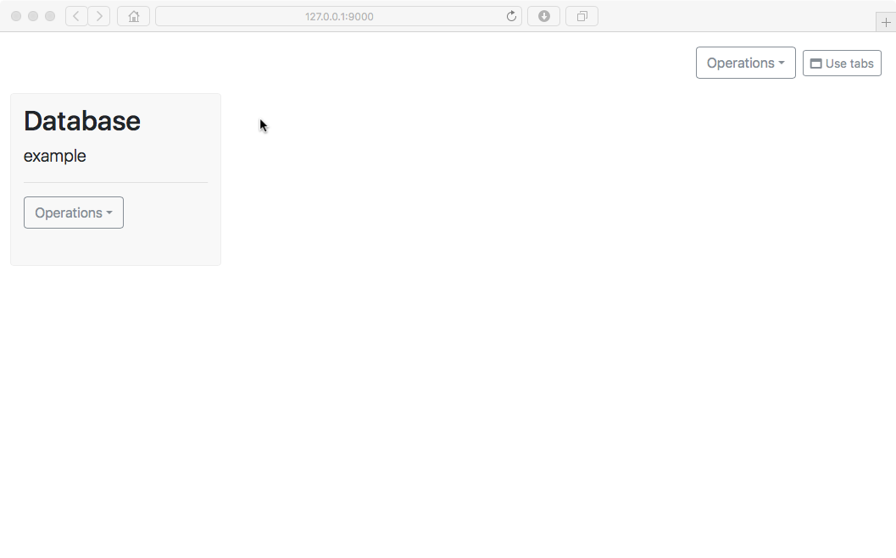

Samlab Manager provides a *dashboard* with *widgets* that you can add,
rearrange, resize, and delete in any way that you like. By default, the
*Database widget* is open, which represents the "example" database
created above. Use the Database widget operations menu to open an
*Observations widget*:

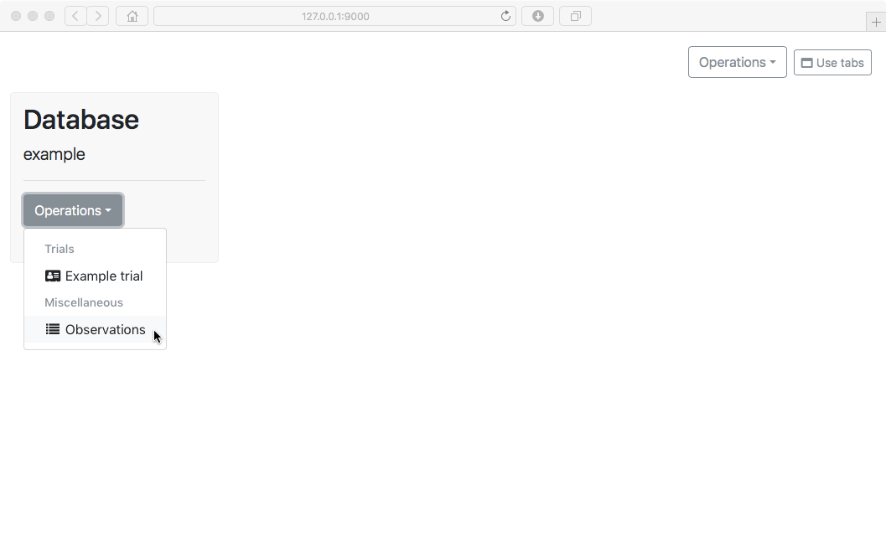

As you can see, the Observations widget displays the number of
observations that we created earlier (1000), provides controls for
choosing an observation, and displays the data ("input" and "output")
stored in the currently-visible observation (it also displays the
observation attributes and tags, though there aren't any in this
example):

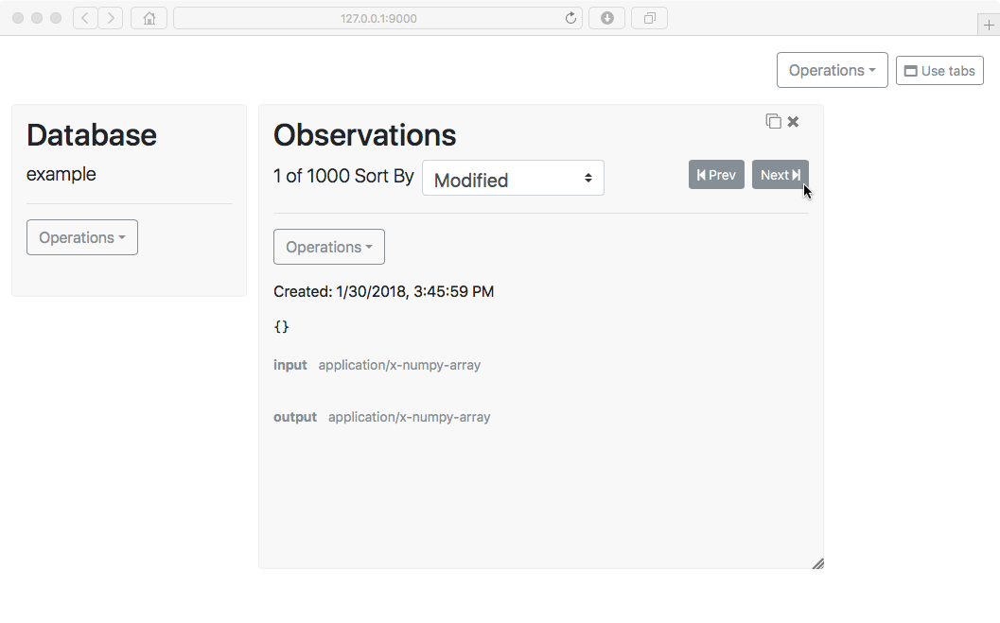

If our observations contained image data, the images themselves would be
displayed. Note that you could use the Observations widget operations
menu to make changes to the current observation:

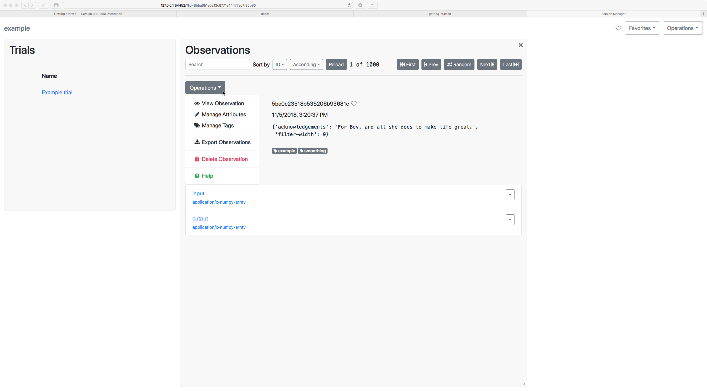

But for now, we will move-on to other things. Click the close button in
the upper-right-hand corner of the Observations widget to remove it, and
use the Database widget operations menu to open the trial that we just
created:

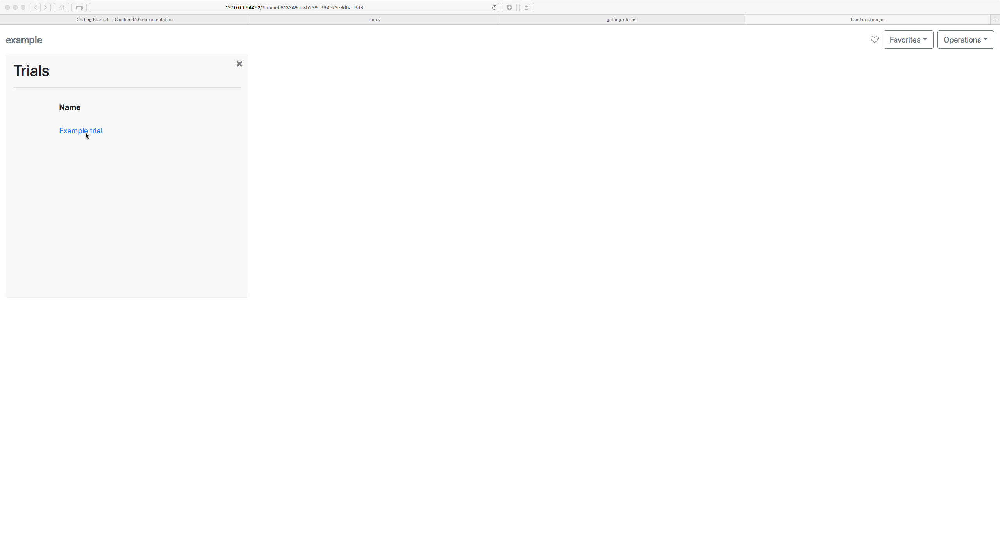

As you might expect, a *Trial widget* opens, displaying the trial's
name, attributes and tags (there are none in this example, of course).

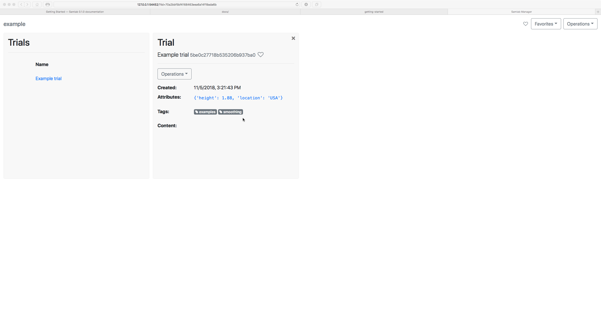

Unsurprisingly, you can use the Trial widget operations menu to make
changes to the trial. You can also open the model we created as part of
the trial:

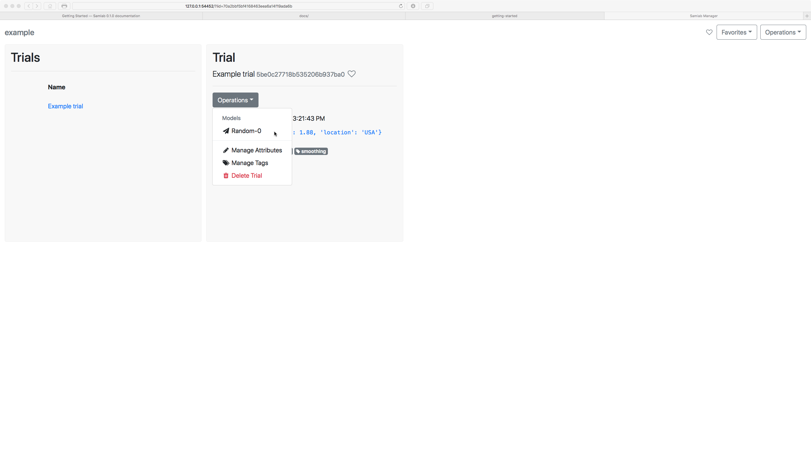

The *Model widget* opens as expected. As usual, it displays the
attributes and tags associated with the model, if any:

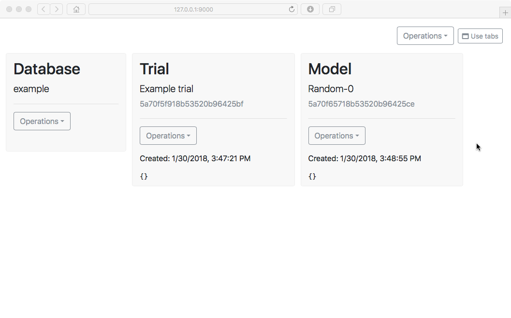

Using the Model widget operations menu, we can display a model-specific
visualization. In this case, let's see how the model's loss function
evolved during training:

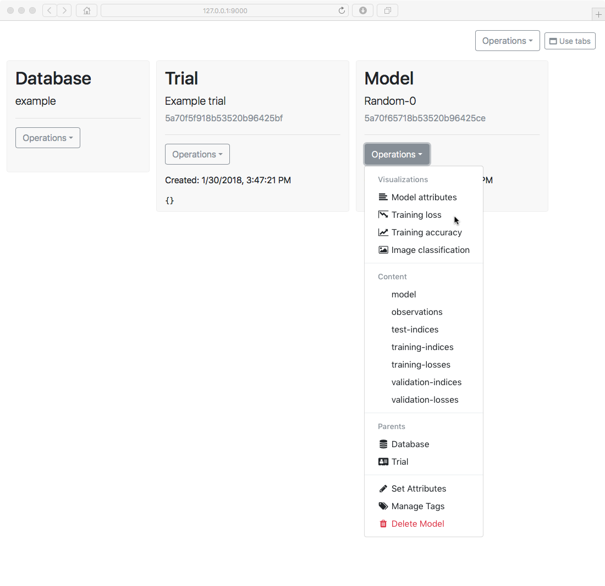

As expected, the *Training Loss widget* opens, and provides an
interactive visualization. Note that storing standard artifacts with a
model is what makes this visualization possible:

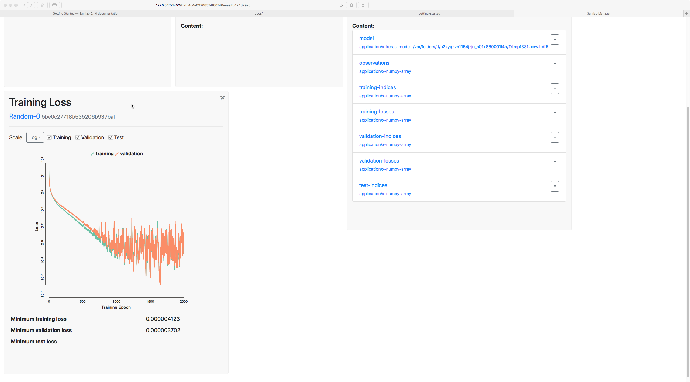

Let's look directly at some of the model content. You should notice that
the Model widget operations menu includes entries for each of the
content roles we stored in the model. Let's open the *model* content:

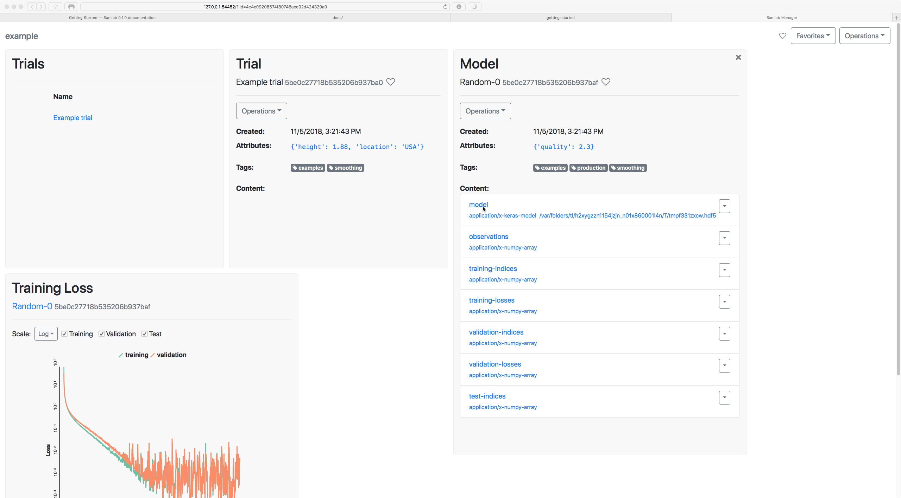

The *Model Content widget* opens, and you can see that - because Samlab
knows that it is a Keras model - it can display a description of the
model layers:

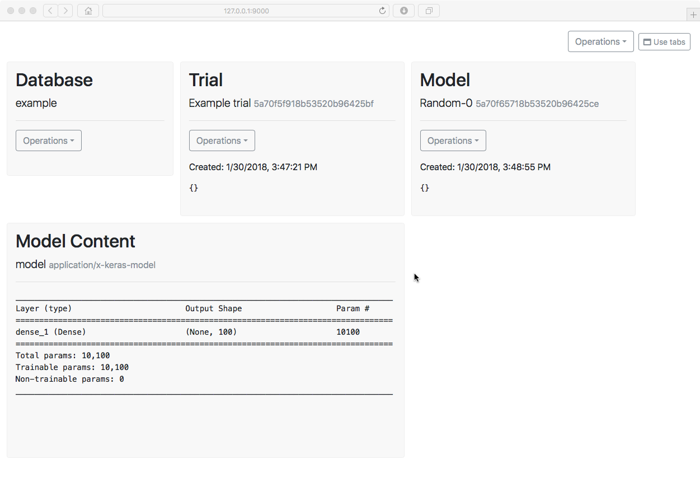

Cleanup
-------

Now, we just need to cleanup the servers we started at the beginning of
this exercise. Stop the Samlab Manager server first:

.. code:: ipython3

    manager.stop()

.. parsed-literal::

    INFO:samlab.manager:Stopping Samlab manager.
    INFO:samlab.manager:Samlab manager stopped.
    INFO:samlab.manager:Stopping gpu task queue.
    INFO:samlab.manager:GPU task queue stopped.
    INFO:samlab.manager:Stopping generic task queue.
    INFO:samlab.manager:Generic task queue stopped.
    INFO:samlab.manager:Stopping message queue.
    INFO:samlab.manager:Message queue stopped.

Finally, stop the temporary database server:

.. code:: ipython3

    db_server.stop()

.. parsed-literal::

    INFO:samlab.database:Stopping database server.
    INFO:samlab.database:Database server stopped.

